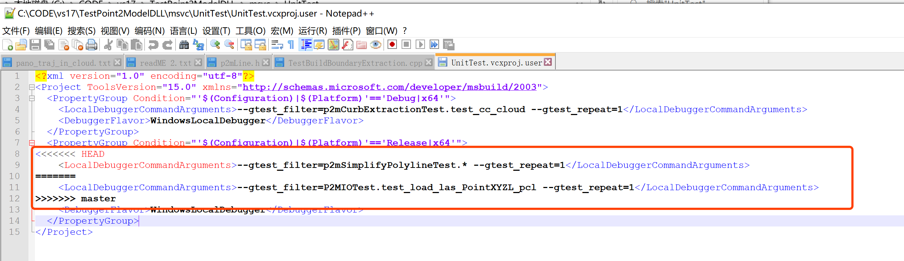
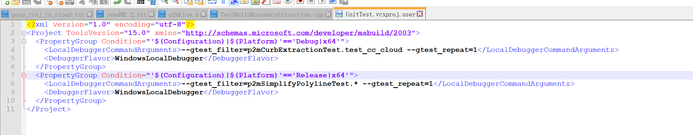

# VS相关的问题

## 1. 在VS工程中，在生成后事件中添加：“将生成的dll、lib、及接口头文件自动复制到相关的文件夹”的相关命令。

问题：error MSB3073: :VCEnd”已退出，代码为 1 error MSB3073: :copy............

解决方案：如果你有多个项目，选中你出问题的项目，右键选择属性>配置属性>生成事件>生成后事件，选择“否”，然后再重新生成即可。

## 2 工程生成dll时，无法同时生成 .lib文件

解决方案：工程 --> 添加 --> 新建项 --> 代码 --> 模块生成文件.def -->添加

3 子分支与主分支同步方法

​			0 在整个TestPoint2Model的仓库目录下，操作一下mixiaoxin分支与master分支等操作。

 1. 切换到自己的分支：git switch mixiaoxin

 2. 将自己分支中的更改推送到远程：git push

 3. 切换到master分支：git switch master

 4. 将master分支的变动同步到本地：git pull

 5. 切换到自己的分支：git switch mixiaoxin

 6. 将master分支和自己的分支合并：git merge master

 7. 遇到coflict：CONFLICT (content): Merge conflict in msvc/UnitTest/UnitTest.vcxproj.user

    Automatic merge failed; fix conflicts and then commit the result.

    出错的地方位于这个.usr文件中，用记事本打开

    

    修改产生冲突的地方：

    

​	修改完冲突后，重现在自己的分支下，add，commit，push即可。

8. pull master出错是因为你的master本地分支改动了，你直接在master执行：

​				git reset --hard && git pull

